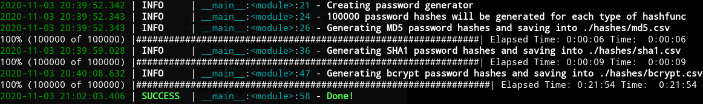

# Human passwords
App that generates passwords “just like humans do” and creates sample of common passwords hashes.

## Setup
To setup, just install packages from **requirements.txt** (recomended to use virtual environment):
    
    pip3 install -r requirements.txt


## password_generator.py
### Usage
```python
>>> import string
>>> import password_generator as pwdgen 
>>> pwdgen.get_random_password(6)
'sUb#<;'
>>> pwdgen.get_random_password(10, string.ascii_letters)
'xIPEWXzuvk'
>>>
>>> pwdgen.get_humanlike_password()
'Jump0famous*2a'
>>> pwdgen.get_humanlike_password()
'Doesmagnet9'
>>>
>>> gen = pwdgen.get_password_generator()
>>> next(gen)
'beatriz'
>>> next(gen)
'tequieromucho'
```
Generator gets password in such way:

  - 10% password from top 100k passwords list
  - 75% password from top 110 passwords list
  -  5% random password
  - 10% generated human like password
  
**Random password** is a random string with length between 6 and 16. It could consist ASCII letters, digits and punctuation characters.

**Human like password** is a password that created from common English words, digits and these characters ```*_.!+-'```.

Top 100k passwords list, top 110 passwords list and common English words located in ```./data``` directory.
## main.py
For each scheme generate 100k of passwords and create a csv file with hashes (and salts) only.



## Hashing schemes
- [MD5](https://en.wikipedia.org/wiki/MD5)
- [SHA1](https://en.wikipedia.org/wiki/SHA-1)
- [bcrypt](https://en.wikipedia.org/wiki/Bcrypt)

